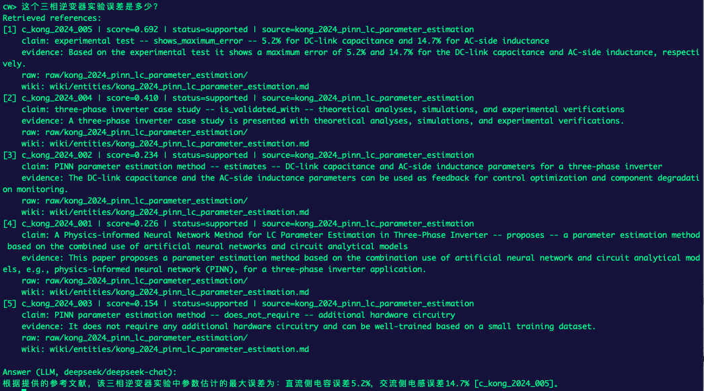
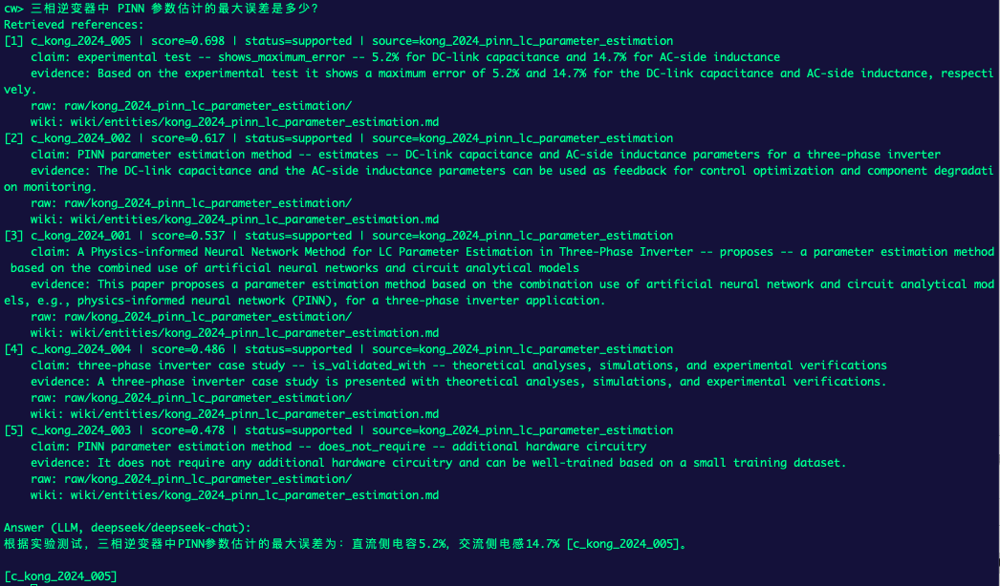
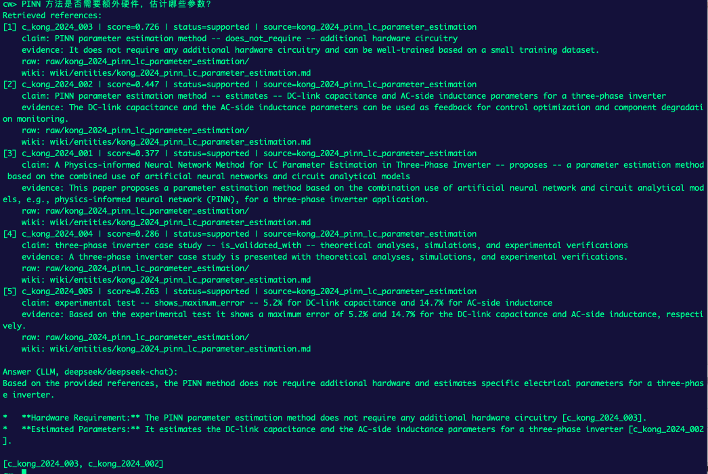
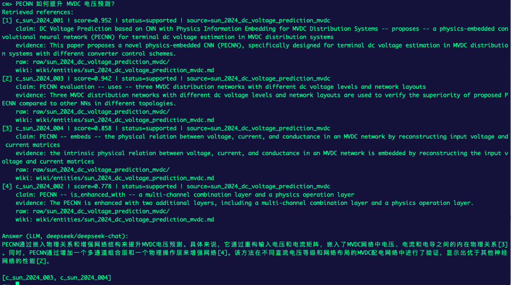
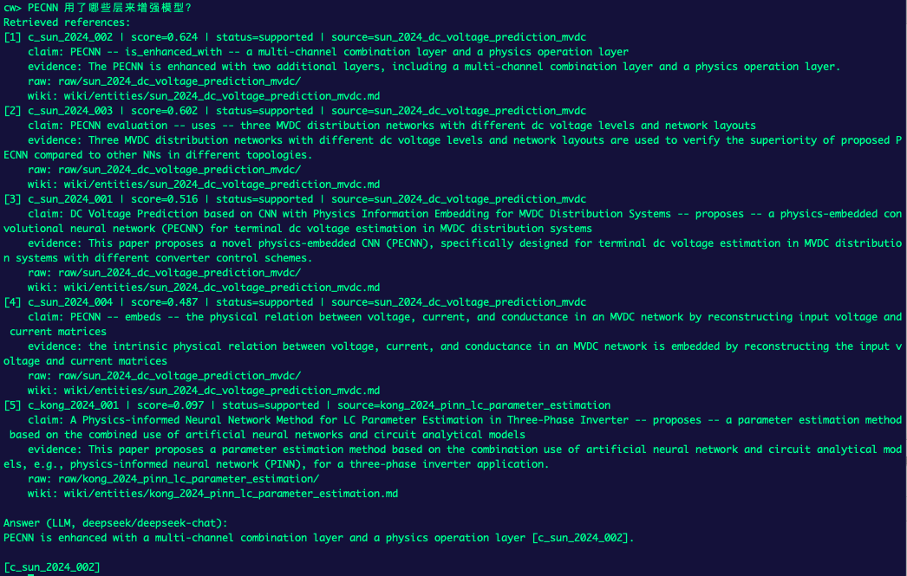
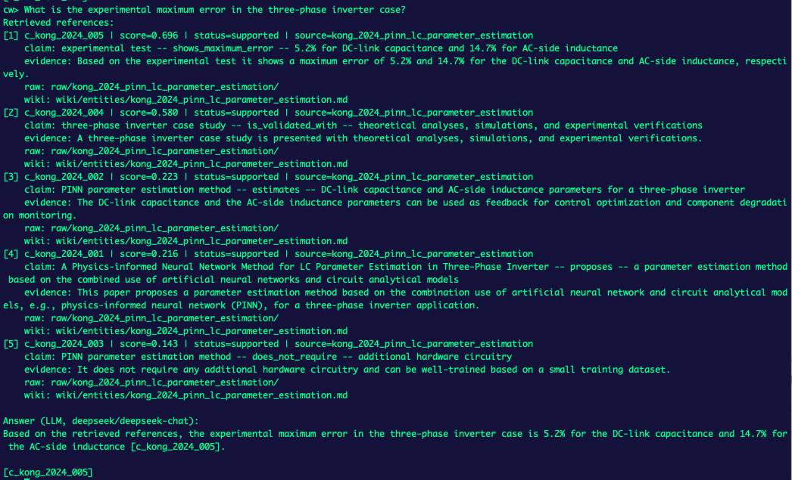
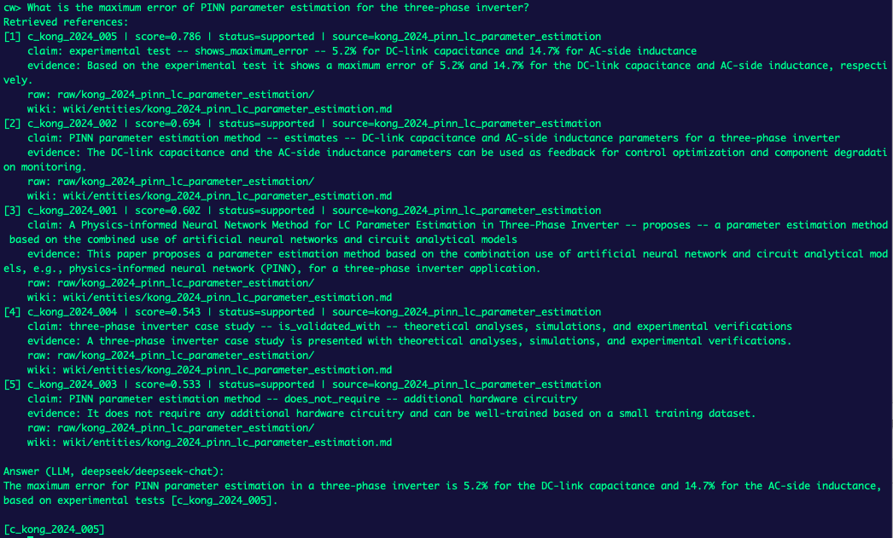
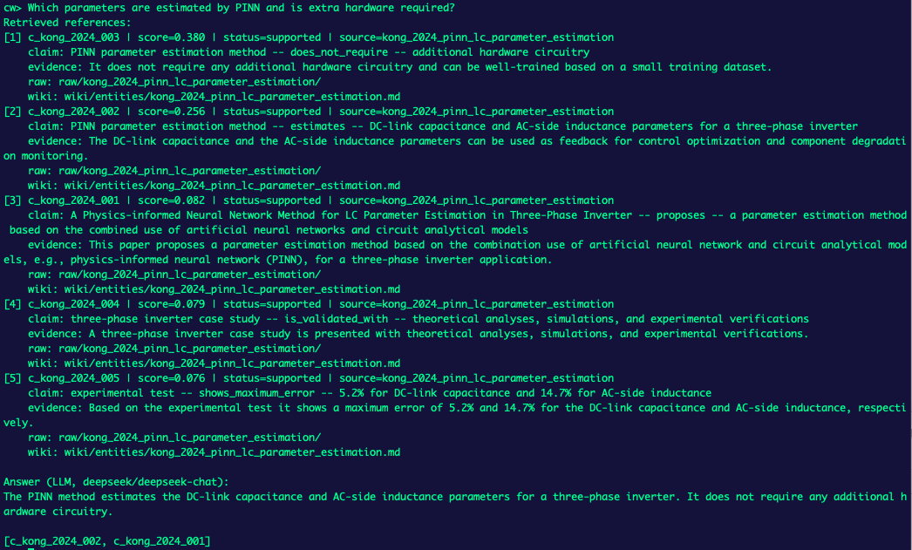
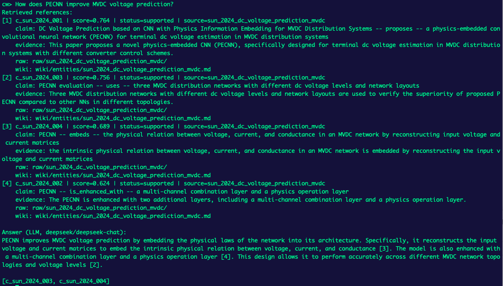
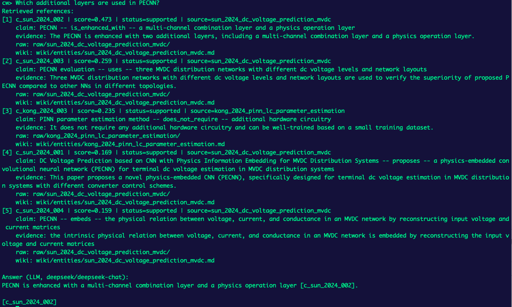

# Compiled Wiki

A knowledge workspace built with compiler principles.

Default documentation is maintained in English in this file. Chinese documentation is available in [README.zh.md](README.zh.md).

Compiled Wiki separates source material, structured intermediate representation, and human-readable pages:

- `raw/` stores immutable source bundles.
- `ir/` stores claims, entities, conflicts, extracts, and candidate claims.
- `wiki/` stores rendered human-readable views.
- `logs/changes.log` stores append-only history.

Automated agents must follow [AGENTS.md](AGENTS.md) before ingesting sources or answering queries.

---

## Architecture

| Layer | Path | Role |
|-------|------|------|
| Sources | `raw/` | Original PDFs, Markdown exports, transcripts, snapshots; read-only for agents |
| IR | `ir/` | Ground-truth structured claims, entities, and conflicts |
| Wiki | `wiki/` | Human-readable rendered pages |
| Logs | `logs/` | Append-only ingest and maintenance history |
| Schemas | `compiler/schemas/` | JSON Schema definitions for IR files |

The wiki is a view. The IR claim layer is the source of compiled knowledge.

---

## Core Model

Claims in `ir/claims.json` include `subject`, `predicate`, `object`, `claim_type`, `source_id`, `evidence_span`, and `status`.

Rules:

- No claim without a source.
- Inference must not be labeled as `SourceFact`.
- When unsure, use `unknown`.
- Conflicting claims must be recorded in `ir/conflicts.json` instead of being merged away.

Entities in `ir/entities.json` resolve aliases to canonical names and attach claims to wiki pages.

---

## Workflow

When adding a new source under `raw/`:

1. Parse candidate claims and entities.
2. Normalize names and remove duplicates.
3. Resolve against existing entities and claims.
4. Validate attribution and claim type.
5. Plan affected entities, pages, and conflicts before writing.
6. Patch only affected IR/wiki sections.
7. Render wiki views from IR.
8. Append to `logs/changes.log`.

Queries should start from `wiki/index.md`, then follow relevant wiki pages and inspect IR claims when citations or disputes are needed.

---

## CLI

Use the existing `rag` conda environment:

```bash
source /Users/jiachongliu/anaconda3/etc/profile.d/conda.sh
conda activate rag
pip install -e .
cw info
```

Common commands:

| Command | Purpose |
|---------|---------|
| `cw raw init <source_id> --title "..."` | Create a source bundle directory |
| `cw raw bundle-pdf <pdf> --source-id <id> --title "..." --execute` | Bundle a PDF already placed under `raw/` |
| `cw index build [--overwrite]` | Build `ir/index.json` retrieval index from IR |
| `cw extract markdown <source_id>` | Generate a normalized Markdown extract under `ir/extracts/` |
| `cw extract llm-claims <source_id> --provider deepseek` | Generate model candidate claims under `ir/candidates/` |
| `cw ask "question" --limit 5` | Ask against wiki/IR and display retrieved citations (auto: use DeepSeek from `.env` if available; if LLM call fails, command reports failure) |
| `cw chat` | Interactive chat loop (same auto mode as `cw ask`) |
| `cw validate` | Validate IR JSON against schemas |
| `cw lint` | Cross-check source ids, claim references, and wiki links |

---

## Current QA Test Result

`cw ask` and `cw chat` run in auto mode: if `DEEPSEEK_API_KEY` is present in `.env` or shell env, they attempt LLM answering based on retrieved references; if key is not configured they use local retrieval-template answers.  
If LLM is configured but the API call fails, the command reports failure instead of silently falling back.  
`cw extract llm-claims` remains a separate LLM path for candidate-claim generation.
For deterministic local-only testing, run the command with `DEEPSEEK_API_KEY` unset in the current shell invocation.

```bash
env -u DEEPSEEK_API_KEY cw ask "DemoWidget standby power" --limit 2
```

Retrieval uses a built index at `ir/index.json` when available. Build or refresh it after IR updates:

```bash
cw index build --overwrite
```

Observed on 2026-04-17:

| Query | Result | Note |
|------|------|------|
| `PECNN 如何提升 MVDC 电压预测？` | Hit 4 Sun et al. 2024 claims | Good Chinese query coverage for PECNN topic |
| `How does PECNN improve MVDC voltage prediction?` | Hit 4 Sun et al. 2024 claims | Strong English retrieval quality |
| `PINN 估计了哪些参数，需要额外硬件吗？` | Hit 4 Kong et al. 2024 claims | Includes parameters + hardware requirement |
| `Which parameters are estimated by PINN and is extra hardware required?` | Hit 4 Kong et al. 2024 claims | Strong English retrieval quality |
| `What is the experimental maximum error for the three-phase inverter case?` | Hit 4 Kong et al. 2024 claims | Includes `5.2%` and `14.7%` error claim |
| `DemoWidget standby power` | Hit 3 demo claims | Baseline English entity query works |
| `三相逆变器实验误差是多少？` | Hit 4 Kong et al. 2024 claims | Chinese query now works via lightweight bilingual query expansion and retrieves the `5.2%` / `14.7%` error claim |

Example output (trimmed) for:
`cw ask "How does PECNN improve MVDC voltage prediction?" --limit 2`

```text
Retrieved references:
[1] c_sun_2024_004 | score=0.641 | status=supported | source=sun_2024_dc_voltage_prediction_mvdc
    evidence: ... physical relation between voltage, current, and conductance ...
[2] c_sun_2024_003 | score=0.625 | status=supported | source=sun_2024_dc_voltage_prediction_mvdc
    evidence: ... three MVDC distribution networks ...

Answer: Based on 2 retrieved claim(s):
- [1] `PECNN` embeds: the physical relation between voltage, current, and conductance ...
- [2] `PECNN evaluation` uses: three MVDC distribution networks ...
```

Example output (trimmed) for LLM configured but unavailable network/API:
`cw ask "Which parameters are estimated by PINN and is extra hardware required?" --limit 2`

```text
LLM call failed (APIConnectionError): Connection error.
```

Example output (trimmed) for:
`cw ask "这个三相逆变器实验误差是多少？" --limit 4`

```text
Retrieved references:
[1] c_kong_2024_004 | ... | source=kong_2024_pinn_lc_parameter_estimation
[2] c_kong_2024_005 | ... | source=kong_2024_pinn_lc_parameter_estimation

Answer (LLM, deepseek/deepseek-chat):
... maximum error is 5.2% for DC-link capacitance and 14.7% for AC-side inductance ...
```

## Test Screenshot Gallery

Click any thumbnail to view the full-size screenshot.

<table>
  <tr>
    <td align="center"><a href="images/1.png"></a><br>Screenshot 1</td>
    <td align="center"><a href="images/2.png"></a><br>Screenshot 2</td>
  </tr>
  <tr>
    <td align="center"><a href="images/3.png"></a><br>Screenshot 3</td>
    <td align="center"><a href="images/4.png"></a><br>Screenshot 4</td>
  </tr>
  <tr>
    <td align="center"><a href="images/5.png"></a><br>Screenshot 5</td>
    <td align="center"><a href="images/6.png"></a><br>Screenshot 6</td>
  </tr>
  <tr>
    <td align="center"><a href="images/7.png"></a><br>Screenshot 7</td>
    <td align="center"><a href="images/8.png"></a><br>Screenshot 8</td>
  </tr>
  <tr>
    <td align="center"><a href="images/9.png"></a><br>Screenshot 9</td>
    <td align="center"><a href="images/10.png"></a><br>Screenshot 10</td>
  </tr>
</table>
